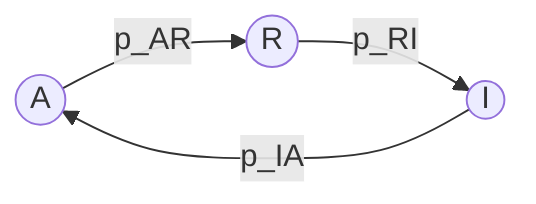
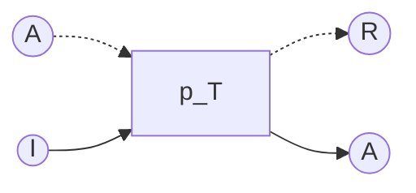

# Simulation of Honey bee shemmering

## Demo

## Tri-State Model

### State transitions of a single agent

### Interaction between neighbors

## refs
- Navin Patel, Henri Huijberts, Kaspar Althoefer, Ketao Zhang, "Mathematical Tri-State Model for Bee Shimmering Propagation Dynamics", [arXiv:2401.14145](https://arxiv.org/abs/2401.14145)
- Japanese natural beekeeping, "Shimmering Waves: How Japanese Honeybees Use Their Wings to Intimidate Predators", [YouTube](https://www.youtube.com/watch?v=Y8k7mTQoIhw) 
